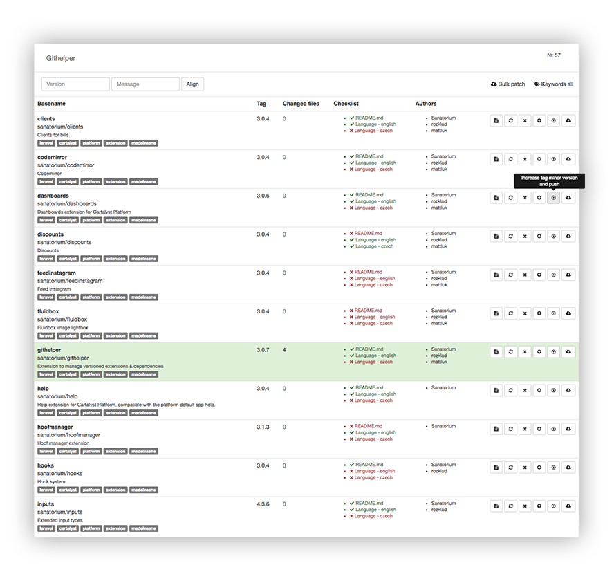

# sanatorium/githelper

Extension to manage versioned extensions & dependencies

## Documentation

Helper for managing git packages within your Cartalyst Platform.

### Configuration

You can setup paths to your extensions or any other packages in config/sanatorium-githelper.php

    /*
    |--------------------------------------------------------------------------
    | Paths
    |--------------------------------------------------------------------------
    |
    | Following paths will be scanned by this extension to find
    | versioned extensions. These will be available in admin
    | area for automated operations.
    |
    */

    'paths' => [
        'extensions/sanatorium',
        '../langs',
    ]
    
### Updating extensions directly from git

Now when you are syncing extensions to git, you might want to always keep your extensions at the latest version. Following artisan command (php artisan dev) is made for that:

    <?php
    
    /**
     * Class Dev
     *
     * Enables you to clone git repositories
     * instead of the composer packages,
     * Meant for development envs.
     *
     * To enable, set environment variable
     * PREFER_GIT=1
     * PREFER_GIT_VENDORS=acme,sanatorium
     *
     *
     * NOTICE OF LICENSE
     *
     * @package    App\Console\Commands
     * @version    1.0.0
     * @author     Sanatorium
     * @license    WTFPL
     * @copyright  (c) 2015-2016, Sanatorium
     * @link       http://sanatorium.ninja
     */
    
    namespace App\Console\Commands;
    
    use Illuminate\Console\Command;
    
    class Dev extends Command
    {
        /**
         * The name and signature of the console command.
         *
         * @var string
         */
        protected $signature = 'dev';
    
        /**
         * The console command description.
         *
         * @var string
         */
        protected $description = 'Enables clone git repositories instead of composer';
    
        /**
         * Checks if current environment configuration
         * is set to prefer git packages, if TRUE
         * triggers cloneGitComposerPackages()
         *
         * @return mixed
         */
        public function handle()
        {
            if ( env('PREFER_GIT') == 1 ) {
                
                $this->cloneGitComposerPackages();
                
            }
        }
    
        /**
         * Takes composer required, scans for packages,
         * checks them against the allowed regular
         * expression found in environment.
         *
         * @see PREFER_GIT_REGEX
         * @example PREFER_GIT_REGEX=/sanatorium\/((?!lang).)*$/
         * @return void
         */
        public function cloneGitComposerPackages()
        {
            $regex = env('PREFER_GIT_REGEX');
    
            $composerPath = base_path('composer.json');
            
            $composer = json_decode( file_get_contents( $composerPath ), true );
    
            foreach ($composer['require'] as $package => $version) {
    
                if ( preg_match($regex, $package) ) {
    
                    $this->clonePackage($package);
    
                }
    
            }
        }
    
        /**
         * Git clones package using git command.
         * Function exec() has to be enabled.
         *
         * @param $package Full name of composer package
         */
        public function clonePackage($package)
        {
            // @todo make this configurable
            $prefix = 'platform-';
    
            $gitRepo = 'git@github.com:' . str_replace('/', '/' . $prefix, $package)  . '.git';
    
            $targetPath = base_path('extensions/' . $package);
    
            if (exec('echo test') == 'test') {
                // Delete the original directory
                exec('rm -rf ' . $targetPath);
    
                // Clone the package to target directory
                exec('git clone ' . $gitRepo . ' ' . $targetPath);
            } else {
               $this->error('Can\'t use git repositories, as exec() function is disabled' . PHP_EOL);
            }
    
        }
    }

## Changelog

- 3.0.6 - 2016-10-02 - Bulk patch packages
- 3.0.5 - 2016-09-30 - Configurable version limits
- 0.2.0 - 2016-05-05 - Further version control, showing checklist for nice-to-have features of extensions (readme, lanuages)

## Support

Point all questions/issues to github [Issues](https://github.com/sanatorium/platform-githelper/issues), we will attend to them asap.